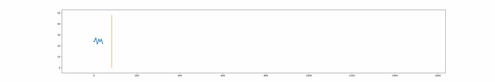
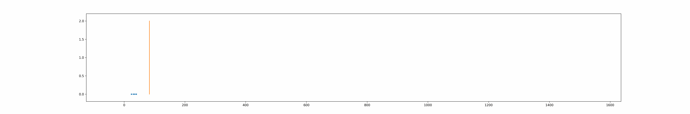

# trainSNNripples
In this section, the SNN is defined and trained. 
## Training
## Test the model
**Load the input from the `extract_Nripples` repository**
```python
trial_input = tensor(np.load('../report_util/input_spikes.npy'), dtype=torch.float32)
print(trial_input.shape)
batches = int(trial_input.shape[1] / input.shape[2])
trial_input2network = torch.zeros((batches, input.shape[1], input.shape[2]))

for i in range(batches):
    trial_input2network[i, :, :] = trial_input[:, i*input.shape[2]:(i+1)*input.shape[2]]

print(trial_input2network.shape)
```

**Perform a prediction**
```python
output = net(trial_input2network.to(device))
print(output.shape)
```

## Visualize the output
```python 
predictions = np.zeros((output.shape[1], output.shape[0] * output.shape[2]))
for i, batch in enumerate(output):
    predictions[:, batch.shape[1]*i:batch.shape[1]*(i+1)] = batch.detach().numpy()

print(predictions.shape)
```

**Use builtin `event.anim` method from `lava.lib.dl.slayer` to create animations**

```python
sys.path.insert(0, '../report_util/extract_Nripples/')
from anim import slayer_gif

slayer_gif(predictions, filename='../report_util/gifs/output', figsize=(30, 5), fps=5)
```
<table>
<tr><td align="center"><b>Input</b></td></tr>
<tr><td>  </td></tr>
<tr><td align="center"><b>Output</b></td></tr>
<tr><td>  </td></tr>
</table>

The network has two outputs neurons:
- **1** will fire when the network predicts a ripple event
- **0** will fire when the network predicts a non-ripple event

As it can be obseerved in the animation, when there is high frequency oscillations (ripples), the network fires at higher frequency in the output neuron 1, otherwise, neuron 0 increases firing frequency.